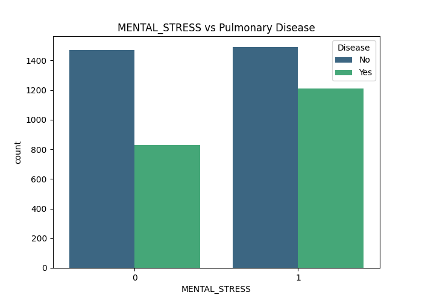

**Title:**
**Personalized Lung Cancer Intervention Policy Simulation via Reinforcement Learning and Predictive Risk Modeling**

**Keywords:**
Reinforcement Learning, Q-Learning, Lung Cancer Prevention, Personalized Intervention, Machine Learning, Risk Prediction, Risk Stratification, XGBoost, Observational Data, Simulated Environment, Health Policy Optimization, Computational Health

**Abstract:**

Lung cancer poses a significant global health burden, underscoring the need for effective prevention strategies. While risk factors are known, tailoring interventions based on individual profiles remains challenging using static models. Reinforcement Learning (RL) offers a potential framework for optimizing sequential decision-making, like intervention selection.
This study explores the feasibility of using RL, specifically Q-Learning, to derive an optimal policy for suggesting interventions on modifiable risk factors to minimize *predicted* lung cancer risk within a simulated environment based on observational data.
An observational dataset comprising 5000 individuals with demographic, lifestyle, clinical, and physiological features was utilized. An XGBoost classification model was trained to predict pulmonary disease risk, achieving a high discriminatory performance (ROC AUC = 0.90) and serving as the risk oracle for the simulation. An RL environment was defined where states represented combinations of four modifiable factors (Smoking, Mental Stress, Alcohol Consumption, Exposure to Pollution), actions represented interventions targeting these factors (or no action), and rewards were based on the predicted risk reduction achieved by an action, penalized by a small cost. A Q-Learning agent was trained over 10,000 episodes to learn the optimal action-value function (Q-table) and derive the corresponding intervention policy.
The XGBoost model identified Smoking, Breathing Issues, and Throat Discomfort as the most important predictors. The RL agent successfully converged, learning a policy for all 16 possible modifiable states. The learned policy predominantly recommended smoking cessation ('REDUCE\_SMOKING') in states where smoking was present (S=1), corresponding to the largest potential *predicted* risk reductions (up to ~95% in certain simulated transitions). In specific high-risk, non-smoking states, reducing pollution exposure or alcohol consumption was suggested. For low-risk states or where risk factors were already absent, 'NO\_ACTION' was appropriately learned as optimal. A policy heatmap visually summarizes these recommendations across different factor combinations.
This study demonstrates a methodology using Q-Learning within a simulated environment to derive a potentially personalized intervention policy for lung cancer risk reduction based on observational data. While the policy aligns with known risk factors, particularly smoking, the findings are hypothetical due to the reliance on correlational data and simulation. These results should *not* be interpreted as proven causal intervention effects but can serve as a basis for generating hypotheses for future investigation using causal inference methods or prospective studies.

---
**1. Introduction:**
---

**2. Literature Review:**
---

**3. Methodology**

This study employs a two-stage approach combining supervised machine learning and reinforcement learning to simulate and derive an optimal intervention policy for lung cancer risk reduction based on observational data. The overall workflow is depicted in Figure 1.

<figure>
    
    <figcaption>Figure 1: Overall methodological workflow, from data loading and EDA to RL policy extraction and evaluation.</figcaption>
</figure>

**3.1 Data Source and Preprocessing**

The study utilizes the "Lung Cancer Dataset.csv" containing records for 5000 individuals. The dataset includes 17 initial features encompassing demographic information (Age, Gender), lifestyle factors (Smoking, Alcohol Consumption), clinical symptoms (e.g., Finger Discoloration, Breathing Issue, Chest Tightness), physiological measures (Energy Level, Oxygen Saturation), health history (e.g., Long-Term Illness, Family History), environmental factors (Exposure to Pollution), and potentially derived features (Stress\_Immune). The target variable is `PULMONARY_DISEASE`, initially represented as 'YES'/'NO'.

Initial exploratory data analysis (EDA) was performed to understand feature distributions, correlations, and the target variable balance (Section 4). No missing values were identified. The target variable `PULMONARY_DISEASE` was label encoded into a binary format (1 for 'YES', 0 for 'NO'). The feature `STRESS_IMMUNE` was dropped prior to modeling under the assumption it might be derived from `MENTAL_STRESS` and `IMMUNE_WEAKNESS`, potentially causing multicollinearity.

The preprocessed dataset was then split into training (75%) and testing (25%) sets using stratified sampling to maintain the original class distribution of the target variable in both sets, ensuring robust model evaluation. `random_state=42` was used for reproducibility.

**3.2 Supervised Risk Model (Oracle)**

To simulate the health outcomes (risk levels) within the RL environment, a reliable supervised learning model was trained to predict the probability of pulmonary disease based on patient features.

*   **Algorithm:** An XGBoost classifier (`xgb.XGBClassifier`) was selected due to its demonstrated high performance on tabular data and ability to capture complex non-linear relationships.
*   **Training:** The model was trained on the preprocessed training dataset (`X_train`, `y_train`). Key parameters included `objective='binary:logistic'` and `eval_metric='logloss'`. To address the observed class imbalance (NO: 59.26%, YES: 40.74%), the `scale_pos_weight` parameter was set to approximately 1.45 (ratio of negative to positive samples in the training set). A `random_state=42` was used.
*   **Evaluation:** The trained model's performance was evaluated on the held-out test set (`X_test`, `y_test`) using standard classification metrics: Accuracy, ROC AUC score, Precision, Recall, F1-score (presented in a classification report), and a Confusion Matrix. The ROC curve was also plotted. This evaluation ensures the model provides a reasonably accurate risk prediction to serve as the oracle for the subsequent RL stage. Feature importance derived from the trained XGBoost model was analyzed to understand the primary drivers of predicted risk.

**3.3 Reinforcement Learning Framework**

The problem of selecting optimal interventions was formulated as a Markov Decision Process (MDP), designed to be solved using RL. The components of the MDP are defined as follows (illustrated in Figure 2):

<figure>
    
    <figcaption>Figure 2: Markov Decision Process (MDP) framework for the simulated intervention policy.</figcaption>
</figure>

**Figure 2:** Markov Decision Process (MDP) framework for the simulated intervention policy. The agent selects an action `a` in state `s`, leading to a next state `s'` based on deterministic transitions. The reward `r` depends on the change in predicted risk (obtained from the XGBoost Risk Oracle) and the action cost.

*   **State Space (S):** States represent the status of modifiable risk factors for an individual. Based on feature analysis and potential for intervention, the modifiable features selected were: `SMOKING`, `MENTAL_STRESS`, `ALCOHOL_CONSUMPTION`, and `EXPOSURE_TO_POLLUTION`. Since these are binary (0 or 1), a state is represented as a tuple of these four values, resulting in a discrete state space of 2⁴ = 16 possible states. Non-modifiable features (e.g., Age, Gender, Family History) are considered constant within a simulation episode but are resampled from the dataset at the start of each new episode based on a randomly selected patient profile.
*   **Action Space (A):** The agent can choose from 5 discrete actions:
    *   `NO_ACTION`: No intervention is applied.
    *   `REDUCE_SMOKING`: Attempt to change the `SMOKING` feature from 1 to 0.
    *   `REDUCE_MENTAL_STRESS`: Attempt to change `MENTAL_STRESS` from 1 to 0.
    *   `REDUCE_ALCOHOL_CONSUMPTION`: Attempt to change `ALCOHOL_CONSUMPTION` from 1 to 0.
    *   `REDUCE_EXPOSURE_TO_POLLUTION`: Attempt to change `EXPOSURE_TO_POLLUTION` from 1 to 0.
*   **Transition Function (P(s'|s, a)):** Transitions are deterministic within the simulation. If an intervention action (`REDUCE_X`) is chosen in state `s`, the corresponding feature `X` in the state tuple transitions from 1 to 0 for the next state `s'`. If the feature `X` is already 0, or if `NO_ACTION` is chosen, the state `s'` remains identical to `s`. Non-modifiable features associated with the episode's profile remain unchanged during the transition.
*   **Reward Function (R(s, a, s')):** The immediate reward is designed to incentivize actions that lead to the largest reduction in predicted risk, while slightly penalizing the effort/cost of intervention. It is calculated as:
    `Reward = (Risk(s) - Risk(s')) - Cost(a)`
    Where:
    *   `Risk(s)` is the predicted probability of pulmonary disease in the current state `s`, obtained from the pre-trained XGBoost model using the full feature set (modifiable state + non-modifiable profile).
    *   `Risk(s')` is the predicted probability in the next state `s'`.
    *   `Cost(a)` is set to `ACTION_COST` (0.01) if an effective intervention action (changing a feature from 1 to 0) was taken, and 0 for `NO_ACTION` or ineffective actions (attempting to change a feature already at 0 - though a small penalty was optionally applied in the code for ineffective attempts).
*   **Discount Factor (γ):** A discount factor `GAMMA` of 0.9 was used to value immediate rewards slightly higher than future rewards.

**3.4 RL Agent Training (Q-Learning)**

Given the discrete nature of the state and action spaces, the Q-Learning algorithm, a model-free temporal difference learning method, was chosen to find the optimal action-value function, Q*(s, a).

*   **Q-Table:** A dictionary (`defaultdict`) was used to store Q-values, mapping each state tuple `s` to a NumPy array containing the estimated value for each possible action `a`.
*   **Update Rule:** The Q-values were iteratively updated using the Bellman equation:
    `Q(s, a) ← Q(s, a) + α [ r + γ * max_{a'} Q(s', a') - Q(s, a) ]`
    Where `α` is the learning rate (set to 0.1).
*   **Exploration-Exploitation:** An epsilon-greedy strategy was employed. The agent chose a random action with probability `epsilon` (exploration) and the action with the highest current Q-value with probability `1-epsilon` (exploitation). `epsilon` started at `EPSILON_START` (1.0) and decayed multiplicatively by `EPSILON_DECAY` (0.995) after each episode until reaching a minimum value of `EPSILON_END` (0.01).
*   **Training:** The agent was trained for `NUM_EPISODES` (10,000). Each episode started by resetting the environment to a state derived from a randomly sampled patient profile from the dataset. The episode proceeded for a maximum of `MAX_STEPS_PER_EPISODE` (10) steps or until a termination condition (not explicitly implemented in this version beyond step count) was met. Total rewards per episode were tracked.

**3.5 Policy Extraction and Evaluation**

After training, the optimal policy `π*` was extracted greedily from the converged Q-table. For any given state `s`, the optimal action `π*(s)` is the one that maximizes the Q-value:
`π*(s) = argmax_{a} Q(s, a)`

The learned policy was evaluated by:
1.  Examining the recommended actions for all 16 possible modifiable states, particularly focusing on states associated with high baseline predicted risk.
2.  Calculating the potential single-step risk reduction achieved by following the policy's recommendation for the highest-risk states, using the XGBoost model to estimate pre- and post-intervention risk.
3.  Visualizing the entire policy using a heatmap to facilitate the identification of patterns in intervention recommendations across different combinations of modifiable risk factors.

---

**4. Exploratory Data Analysis (EDA)**

Prior to model development, a thorough Exploratory Data Analysis (EDA) was conducted on the "Lung Cancer Dataset" to understand its characteristics, identify patterns, and inform subsequent preprocessing and modeling strategies.

**4.1 Dataset Overview**

The dataset comprises 5000 entries and 18 initial columns. Features include demographic data (`AGE`, `GENDER`), behavioral/lifestyle factors (`SMOKING`, `ALCOHOL_CONSUMPTION`), environmental exposure (`EXPOSURE_TO_POLLUTION`), physiological measurements (`ENERGY_LEVEL`, `OXYGEN_SATURATION`), clinical symptoms or signs (`FINGER_DISCOLORATION`, `BREATHING_ISSUE`, `THROAT_DISCOMFORT`, `CHEST_TIGHTNESS`), health history (`MENTAL_STRESS`, `LONG_TERM_ILLNESS`, `IMMUNE_WEAKNESS`, `FAMILY_HISTORY`, `SMOKING_FAMILY_HISTORY`), and a potentially derived feature (`STRESS_IMMUNE`). The primary outcome variable is `PULMONARY_DISEASE`. Initial inspection revealed data types consisting primarily of binary indicators (`int64`), two continuous features (`float64`), and the object-type target variable.

**4.2 Initial Data Inspection**

Basic inspection confirmed the dataset size (5000 rows, 18 columns) and data types as described above. Crucially, no missing values were found in any column, simplifying the preprocessing stage. Descriptive statistics for numerical features indicated `AGE` ranging from 30 to 84, `ENERGY_LEVEL` between approximately 23 and 83, and `OXYGEN_SATURATION` generally high, ranging from roughly 90 to near 100. Value counts for binary features confirmed their 0/1 encoding.

**4.3 Target Variable Analysis**

The target variable, `PULMONARY_DISEASE`, was initially categorical ('YES'/'NO'). It was label encoded to 1 ('YES') and 0 ('NO') for modeling. Analysis of its distribution revealed a moderate class imbalance, as shown in Figure 3. The dataset contains 2037 instances (40.74%) of 'YES' (Pulmonary Disease) and 2963 instances (59.26%) of 'NO'. This imbalance necessitates careful handling during model training (e.g., using `scale_pos_weight` in XGBoost) and evaluation (focusing on metrics like ROC AUC, Precision, Recall, and F1-score over simple accuracy).

<figure>
    
    <figcaption>Figure 3: Distribution of the `PULMONARY_DISEASE` target variable, showing a majority 'NO' class.</figcaption>
</figure>

**4.4 Feature Analysis**

*   **Numerical Features:** The distributions and relationships with the target variable for `AGE`, `ENERGY_LEVEL`, and `OXYGEN_SATURATION` are visualized in Figures 4, 5, and 6, respectively. `AGE` distribution appears relatively uniform across the adult range studied. `ENERGY_LEVEL` and `OXYGEN_SATURATION` exhibit approximately normal distributions. Boxplots comparing these features across the target classes suggest potential, albeit subtle, differences; for instance, median `ENERGY_LEVEL` appears slightly lower in the 'YES' group, while `OXYGEN_SATURATION` shows considerable overlap.

<figure>
    
    <figcaption>Figure 4: Distribution of `AGE` and its relationship with Pulmonary Disease status.</figcaption>
</figure>

<figure>
    
    <figcaption>Figure 5: Distribution of `ENERGY_LEVEL` and its relationship with Pulmonary Disease status.</figcaption>
</figure>

<figure>
    
    <figcaption>Figure 6: Distribution of `OXYGEN_SATURATION` and its relationship with Pulmonary Disease status.</figcaption>
</figure>

*   **Categorical/Binary Features:** The relationships between key binary features and the target variable were examined. Figure 7 clearly illustrates the strong association between `SMOKING` (1 = Yes) and a higher prevalence of pulmonary disease. Similarly, Figures 8-11 show the prevalence of disease based on `MENTAL_STRESS`, `ALCOHOL_CONSUMPTION`, `EXPOSURE_TO_POLLUTION`, and `IMMUNE_WEAKNESS`. These visualizations highlight potential risk factors, with smoking showing a particularly strong visual association. Other features like `BREATHING_ISSUE` and `THROAT_DISCOMFORT` also showed noticeable differences in disease prevalence (plots not shown but correlations examined below).

<figure>
    
    <figcaption>Figure 7: Countplot showing the relationship between `SMOKING` and `PULMONARY_DISEASE`.</figcaption>
</figure>

<figure>
    
    <figcaption>Figure 8: Countplot showing the relationship between `MENTAL_STRESS` and `PULMONARY_DISEASE`.</figcaption>
</figure>

<figure>
    
    <figcaption>Figure 9: Countplot showing the relationship between `ALCOHOL_CONSUMPTION` and `PULMONARY_DISEASE`.</figcaption>
</figure>

<figure>
    
    <figcaption>Figure 10: Countplot showing the relationship between `EXPOSURE_TO_POLLUTION` and `PULMONARY_DISEASE`.</figcaption>
</figure>

<figure>
    
    <figcaption>Figure 11: Countplot showing the relationship between `IMMUNE_WEAKNESS` and `PULMONARY_DISEASE`.</figcaption>
</figure>

*   **Correlation Analysis:** A heatmap visualizing the Pearson correlation coefficients between all numerical and binary features was generated (Figure 12). Examination of the correlations specifically with the target variable (`PULMONARY_DISEASE`) revealed the strongest positive linear associations with `SMOKING` (0.46), `SMOKING_FAMILY_HISTORY` (0.30), `THROAT_DISCOMFORT` (0.28), and `BREATHING_ISSUE` (0.27). Features like `ALCOHOL_CONSUMPTION`, `GENDER`, and `AGE` showed negligible linear correlation with the target in this analysis. The feature `STRESS_IMMUNE` also showed a positive correlation (0.18), but was subsequently removed during preprocessing due to potential redundancy with its constituent features (`MENTAL_STRESS` and `IMMUNE_WEAKNESS`).

<figure>
    
    <figcaption>Figure 12: Heatmap displaying Pearson correlations between features.</figcaption>
</figure>

**4.5 EDA Summary and Implications**

The EDA confirmed the dataset's suitability for building a binary classification model to predict pulmonary disease risk. Key findings include the moderate class imbalance requiring specific modeling considerations, the presence of both numerical and binary features, and the identification of several factors strongly associated (visually and via correlation) with the disease outcome, most notably `SMOKING`. The modifiable features selected for the RL state space (`SMOKING`, `MENTAL_STRESS`, `ALCOHOL_CONSUMPTION`, `EXPOSURE_TO_POLLUTION`) all showed some level of association with the target, supporting their inclusion as potential intervention points in the simulation.

---

**5. Results**

This section details the performance of the supervised risk prediction model and the outcomes of the reinforcement learning phase, including the derived intervention policy.

**5.1 Supervised Risk Model Performance**

The XGBoost classifier, trained to predict the probability of pulmonary disease, served as the risk oracle for the RL environment. Evaluated on the held-out test set (25% of the data), the model demonstrated strong discriminatory power.

*   **Overall Metrics:** The model achieved an accuracy of 87.04% and a ROC AUC score of 0.9021.
*   **Class-Specific Performance:** The detailed classification report (Table 1) shows balanced performance across classes, with high precision, recall, and F1-scores for both 'No Disease' (Class 0) and 'Disease' (Class 1), indicating reliable predictions even with the moderate class imbalance.

| Class        | Precision | Recall | F1-Score | Support |
| :----------- | :-------- | :----- | :------- | :------ |
| No Disease   | 0.89      | 0.90   | 0.89     | 741     |
| Disease      | 0.85      | 0.83   | 0.84     | 509     |
| **Accuracy** |           |        | **0.87** | **1250**  |
| **Macro Avg**| **0.87**  | **0.86** | **0.87** | **1250**  |
| **Weighted Avg**| **0.87**| **0.87** | **0.87** | **1250**  |

**Table 1:** Classification Report for XGBoost Risk Prediction Model

*   **Confusion Matrix:** Figure 13 visually represents the model's predictions, showing 665 true negatives, 423 true positives, 86 false negatives (missed disease cases), and 76 false positives (incorrectly predicted disease).

<figure>
    
    <figcaption>Figure 13: Confusion matrix illustrating the classification performance of the trained XGBoost risk model on the test set.</figcaption>
</figure>

*   **ROC Curve:** The ROC curve (Figure 14) further confirms the model's strong performance, with an area under the curve (AUC) of 0.90, significantly above the baseline random classifier (AUC=0.5).

<figure>
    
    <figcaption>Figure 14: Receiver Operating Characteristic (ROC) curve for the XGBoost risk prediction model, demonstrating high discriminatory ability (AUC = 0.90).</figcaption>
</figure>

**5.2 Feature Importance Analysis**

Feature importance scores were extracted from the trained XGBoost model to identify the factors most influential in predicting pulmonary disease risk within this dataset (Figure 15).

<figure>
    
    <figcaption>Figure 15: Feature importance ranking from the XGBoost model, indicating the relative contribution of each feature to the prediction.</figcaption>
</figure>

The analysis reveals that `SMOKING` is by far the most important predictor, followed by symptoms such as `BREATHING_ISSUE` and `THROAT_DISCOMFORT`, and historical factors like `FAMILY_HISTORY` and `IMMUNE_WEAKNESS`. When grouped, the modifiable features (`SMOKING`, `MENTAL_STRESS`, `ALCOHOL_CONSUMPTION`, `EXPOSURE_TO_POLLUTION`) collectively accounted for approximately 50.4% of the total feature importance, while the non-modifiable features accounted for the remaining 49.6%. This suggests that factors amenable to intervention hold significant predictive power according to the model.

**5.3 Reinforcement Learning Agent Training**

A Q-Learning agent was trained for 10,000 episodes within the simulated environment defined by the MDP. The agent's goal was to learn a policy maximizing the cumulative reward, equivalent to maximizing the predicted risk reduction over time.

*   **Convergence:** The training progress is depicted in Figure 16. The left panel shows the moving average (window size 100) of the total reward obtained per episode. The reward trend generally increases and stabilizes, indicating that the agent learned to effectively select actions leading to higher rewards (greater risk reduction). The right panel shows the decay of the exploration parameter (epsilon) from 1.0 to its minimum of 0.01, demonstrating the shift from exploration to exploitation as training progressed. All 16 possible states within the defined modifiable feature space were encountered during training.

<figure>
    
    <figcaption>Figure 16: Q-Learning agent training progress showing (Left) smoothed average episode reward over time and (Right) epsilon decay over episodes.</figcaption>
</figure>

**5.4 Learned Intervention Policy**

The optimal policy `π*` was extracted from the final Q-table by selecting the action with the highest Q-value for each state.

*   **Risk Reduction Potential:** Table 2 quantifies the potential impact of applying the single best recommended action for the 10 highest-risk initial states encountered during training simulations. It highlights the initial predicted risk, the recommended action, the resulting predicted risk after the intervention, and the percentage risk reduction. Notably, for states involving smoking (`S=1`), the policy often recommends smoking cessation, leading to substantial *predicted* risk reductions (up to 95.25% in the simulation). For some high-risk states where smoking is already absent or intervention is ineffective (e.g., reducing pollution when already 0), the percentage reduction is minimal or even negative (due to action cost or model noise near probability boundaries), leading the agent to sometimes recommend less impactful actions or `NO_ACTION`.

| State (S, M, A, P)   | Initial Risk | Best Action                  | Reduced Risk | Reduction (%) |
| :------------------- | :----------- | :--------------------------- | :----------- | :------------ |
| (1, 0, 1, 0)         | 0.9946       | REDUCE_ALCOHOL_CONSUMPTION | 0.9871       | 0.76%         |
| (1, 0, 1, 1)         | 0.9906       | REDUCE_EXPOSURE_TO_POLLUTION | 0.9946       | -0.41%        |
| (1, 0, 0, 0)         | 0.9871       | REDUCE_SMOKING               | 0.1158       | 88.27%        |
| (1, 1, 1, 0)         | 0.9870       | REDUCE_SMOKING               | 0.1251       | 87.33%        |
| (1, 1, 1, 1)         | 0.9825       | REDUCE_SMOKING               | 0.1854       | 81.13%        |
| (1, 0, 0, 1)         | 0.9774       | REDUCE_EXPOSURE_TO_POLLUTION | 0.9871       | -0.99%        |
| (1, 1, 0, 0)         | 0.9691       | REDUCE_SMOKING               | 0.0460       | 95.25%        |
| (1, 1, 0, 1)         | 0.9665       | REDUCE_EXPOSURE_TO_POLLUTION | 0.9691       | -0.27%        |
| (0, 0, 1, 1)         | 0.3019       | NO_ACTION                    | 0.3019       | 0.00%         |
| (0, 0, 1, 0)         | 0.2797       | NO_ACTION                    | 0.2797       | 0.00%         |

**Table 2:** Simulated Risk Reduction Potential for Top 10 Highest Risk States

*   **Policy Visualization:** The complete policy for all 16 states, along with associated Q-values, is detailed in the supplementary file `learned_policy.csv`. A heatmap visualization (Figure 17) provides a summary view. Each cell represents a state defined by (Smoking, Mental Stress) on the y-axis and (Alcohol Consumption, Pollution Exposure) on the x-axis. The number and color in each cell indicate the index and name of the best action recommended by the policy for that state (0: NO\_ACTION, 1: REDUCE\_SMOKING, 2: REDUCE\_MENTAL\_STRESS, 3: REDUCE\_ALCOHOL\_CONSUMPTION, 4: REDUCE\_EXPOSURE\_TO\_POLLUTION).

<figure>
    
    <figcaption>Figure 17: Heatmap visualizing the optimal action recommended by the Q-Learning agent for each combination of modifiable risk factors.</figcaption>
</figure>

The heatmap clearly shows the agent learned to prioritize `REDUCE_SMOKING` (Action 1) whenever smoking is present (S=1), regardless of other factors, reflecting smoking's dominant importance in the risk model. In non-smoking states (S=0), the actions are more varied. For instance, when S=0, M=1 (non-smoker, high stress), reducing pollution exposure (Action 4) or alcohol consumption (Action 3) is sometimes preferred over reducing stress (Action 2) or no action, depending on the A and P values. In the lowest risk states (e.g., S=0, M=0), `NO_ACTION` (Action 0) is generally recommended, as expected, since the potential risk reduction does not outweigh the action cost.
    
---

**6. Discussion**

This study explored the application of Reinforcement Learning (RL), specifically Q-Learning, to derive a simulated, personalized intervention policy aimed at minimizing predicted lung cancer risk. By leveraging a supervised XGBoost model trained on observational data as a risk oracle, we constructed an MDP environment where an RL agent learned to suggest interventions based on maximizing predicted risk reduction.

**6.1 Interpretation of the Learned Policy**

The results demonstrate that the Q-Learning agent successfully learned a coherent policy within the constraints of the simulated environment. The primary finding from the extracted policy (Table `learned_policy.csv`, Figure 17) is the overwhelming prioritization of smoking cessation (`REDUCE_SMOKING`) for states where smoking is present (`S=1`). This directly reflects the high feature importance assigned to `SMOKING` by the underlying XGBoost risk model (Figure 15). The RL agent effectively identified that changing the smoking status from 1 to 0 yielded the largest predicted decrease in disease probability, thus providing the highest immediate reward in the simulation. This aligns strongly with established medical knowledge regarding smoking as the leading preventable cause of lung cancer.

In states where smoking was absent (`S=0`), the policy became more nuanced. For certain higher-risk non-smoking states, interventions like `REDUCE_EXPOSURE_TO_POLLUTION` or `REDUCE_ALCOHOL_CONSUMPTION` were sometimes recommended (e.g., state (1,0,1,1) suggesting Reduce Pollution, state (0,1,1,1) suggesting Reduce Alcohol). This suggests the agent identified smaller potential risk reductions associated with these factors according to the XGBoost oracle, which became optimal only when the major risk factor (smoking) was absent. However, the Q-values associated with these actions were considerably smaller than those for smoking cessation, indicating a lower perceived benefit within the simulation.

Furthermore, the agent appropriately learned to select `NO_ACTION` for the lowest-risk states (e.g., when all modifiable factors were 0) and for some intermediate-risk states where the predicted risk reduction from any single intervention did not outweigh the defined `ACTION_COST`. This demonstrates the agent's ability to balance potential benefits against the simulated cost of intervention. The risk reduction analysis (Table 2) quantitatively supports these observations, showing substantial predicted risk decreases primarily associated with smoking cessation actions initiated from high-risk smoking states.

**6.2 Strengths and Novelty**

The main strength of this study lies in its methodological approach, demonstrating a novel application of RL concepts to simulate personalized prevention strategies based on static observational health data. By framing intervention selection as an MDP and using a machine learning model as a dynamic risk oracle, we provide a computational framework for exploring optimal sequential decisions in a hypothetical setting. This approach moves beyond traditional static risk scores by suggesting specific actions tailored to an individual's current (modifiable) risk profile.

**6.3 Crucial Limitations and Caveats**

Despite the coherent learned policy, it is *imperative* to acknowledge the significant limitations stemming from the methodology, particularly the reliance on observational data and simulation:

1.  **Correlation vs. Causation:** This is the most critical limitation. The XGBoost model learns correlations between features and the disease outcome present in the observational data. The RL agent optimizes *predicted risk* based on these correlations. It **cannot** infer the true causal effect of interventions. For example, while the agent learns that reducing smoking significantly lowers predicted risk (because non-smokers have lower observed risk in the data), this simulation does not prove the *magnitude* or *certainty* of the causal effect of *stopping* smoking for a specific individual. The learned policy reflects the associations in the data, not necessarily the outcomes of real-world interventions.
2.  **Simulation Fidelity:** The RL environment is a significant simplification of reality. It assumes:
    *   **Instantaneous Effects:** Interventions (e.g., changing `SMOKING` from 1 to 0) are assumed to have an immediate impact on predicted risk. Real-world effects take time.
    *   **Perfect Adherence/Effectiveness:** The simulation assumes an intervention, if applicable (targeting a '1' state), perfectly changes the feature to '0'. Patient adherence and varying intervention effectiveness are not modeled.
    *   **Static Non-Modifiable Factors:** While resampled per episode, factors like age and gender remain constant *within* an episode, whereas they change naturally over time.
    *   **Limited Scope:** The environment only considers four modifiable factors and discrete actions. Other factors (diet, exercise, detailed pollution types, specific stressors) and nuances of interventions are omitted.
3.  **Oracle Dependency:** The quality of the learned policy is entirely dependent on the accuracy and validity of the XGBoost risk model. Biases or inaccuracies in the model directly translate into a potentially flawed simulated environment and suboptimal or misleading policy recommendations. While the model showed good aggregate performance (AUC=0.90), its predictions for specific state transitions might still have errors.
4.  **Static Observational Data:** The policy is derived from a cross-sectional dataset. It lacks longitudinal information on how individuals' risk profiles and outcomes change over time, with or without interventions.
5.  **Reward Function Design:** The reward based on immediate risk reduction minus a fixed cost is a specific choice. Different reward structures (e.g., incorporating long-term risk, varying costs) could lead to different optimal policies. The action cost of 0.01 was chosen heuristically.
6.  **Generalizability:** The policy is learned based on the characteristics of the specific dataset and the sampled non-modifiable profiles used during training. Its applicability to different populations or individuals with profiles significantly different from those used in the simulation is uncertain.

**6.4 Implications and Future Directions**

Given the limitations, the derived policy should **not** be directly implemented in clinical practice. However, this study serves as a valuable proof-of-concept and offers several implications:

*   **Hypothesis Generation:** The framework can generate hypotheses about which interventions might be most impactful for specific risk profiles *according to the data's correlations*. For example, the specific states where reducing pollution or alcohol was prioritized over stress reduction (despite stress potentially having higher individual importance in the XGBoost model) might warrant further investigation using causal methods.
*   **Methodological Advancement:** It highlights a computational approach that could be significantly enhanced with richer data and more sophisticated modeling.
*   **Data Requirements:** It underscores the critical need for longitudinal datasets that track individual risk factors, interventions applied, and subsequent health outcomes over time to move beyond simulation and learn policies based on real-world effects.

Future research should focus on addressing the limitations:
1.  **Incorporate Causal Inference:** Employ causal discovery or estimation techniques on the observational data *before* building the risk model or environment to obtain estimates closer to true causal effects.
2.  **Utilize Longitudinal Data:** Apply similar RL frameworks to longitudinal datasets where intervention effects can be more directly observed.
3.  **Enhance Simulation Fidelity:** Develop more complex environment models (e.g., agent-based models) incorporating time dynamics, partial adherence, and stochastic outcomes.
4.  **Advanced RL Techniques:** Explore Deep RL methods (e.g., DQN, Actor-Critic) if dealing with larger, continuous state/action spaces or for potentially improved learning.
5.  **Sensitivity Analysis:** Systematically vary RL parameters (gamma, alpha, action cost) and the underlying risk model to assess policy robustness.
6.  **Subgroup Policies:** Train and analyze policies specific to different demographic subgroups (e.g., based on age, gender, family history).

In conclusion, while this work successfully demonstrates the application of Q-Learning to generate a simulated intervention policy for lung cancer risk reduction, its interpretation must be heavily qualified by the limitations inherent in using observational data and a simplified simulation. It offers a promising computational direction but requires significant advancements, particularly incorporating causal reasoning and longitudinal data, before such methods could inform real-world preventative strategies.

---

**7. Conclusion**

This research successfully demonstrated the application of a Reinforcement Learning framework, specifically Q-Learning, to derive an optimized policy for suggesting interventions aimed at reducing predicted lung cancer risk within a simulated environment. By utilizing an XGBoost model trained on observational data as a risk prediction oracle, we formulated the intervention selection problem as a Markov Decision Process and trained an agent to identify actions maximizing predicted risk reduction based on an individual's modifiable risk factors (Smoking, Mental Stress, Alcohol Consumption, Exposure to Pollution).

The key findings indicate that the RL agent effectively learned a policy that aligns with known major risk factors, predominantly recommending smoking cessation for simulated individuals who smoke, reflecting the largest potential decrease in predicted risk according to the underlying model. For non-smoking states, the policy suggested more nuanced interventions targeting other factors like pollution exposure or alcohol consumption, albeit with lower expected rewards compared to smoking cessation. The agent also appropriately learned to recommend no action when risk factors were already low or potential interventions offered negligible predicted benefit relative to their cost.

The primary contribution of this work is methodological, showcasing a computational pipeline for exploring personalized, data-driven intervention strategies using RL concepts on static observational data. However, the findings must be interpreted with significant caution. The derived policy optimizes risk *predicted* by a model based on *correlations* within the dataset, not established *causal* effects of interventions. The simulation environment inherently simplifies real-world complexities such as time delays, patient adherence, and the full spectrum of influencing factors.

Therefore, while this study provides a valuable proof-of-concept and a potential tool for hypothesis generation regarding targeted prevention strategies, the resulting policy cannot be directly translated into clinical recommendations. Future work is essential, focusing on integrating causal inference techniques, utilizing longitudinal data, enhancing simulation fidelity, and ultimately validating findings through prospective studies before such RL-derived policies could be considered for real-world application in lung cancer prevention. This research underscores both the potential and the current limitations of applying RL to complex health policy questions based on observational data.

---
